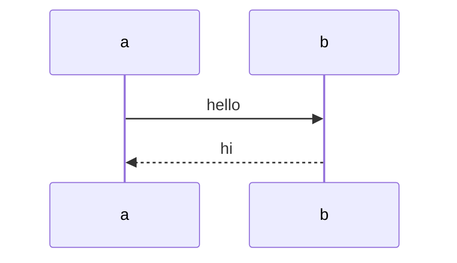
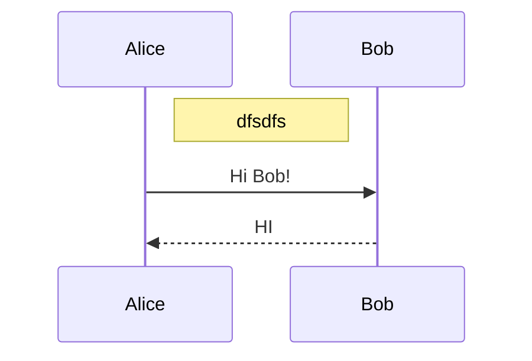
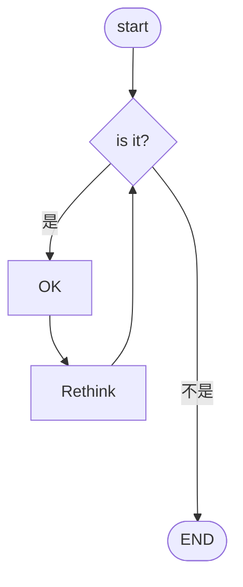
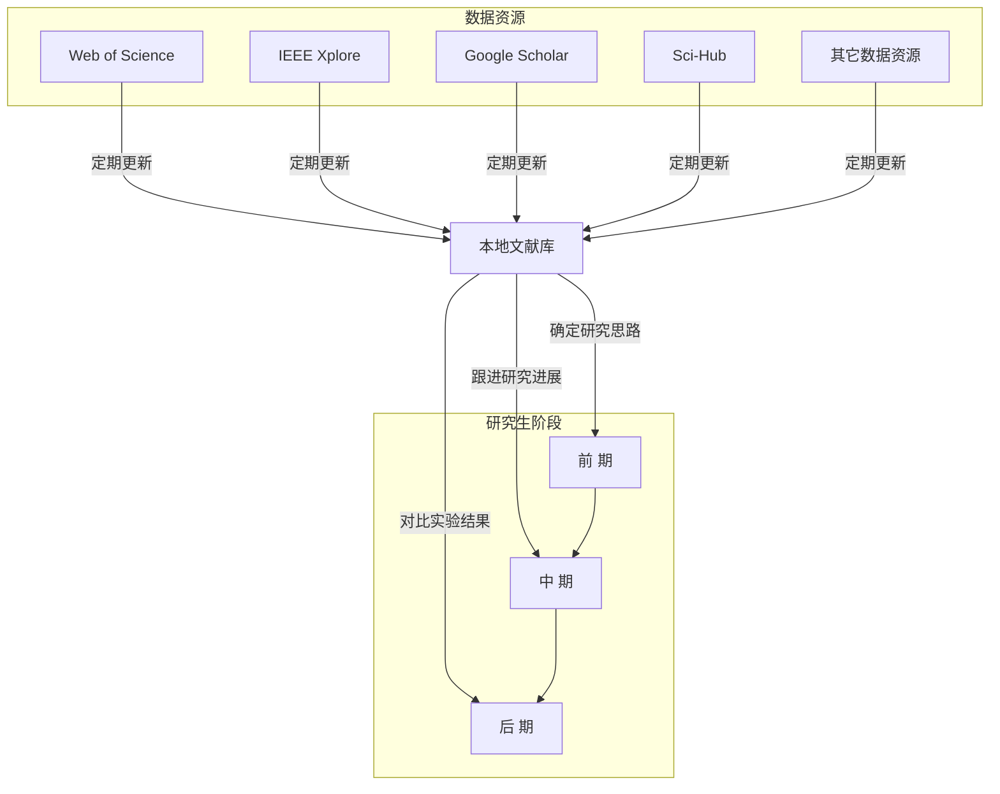
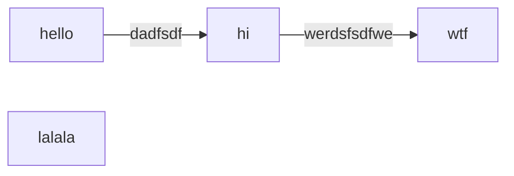
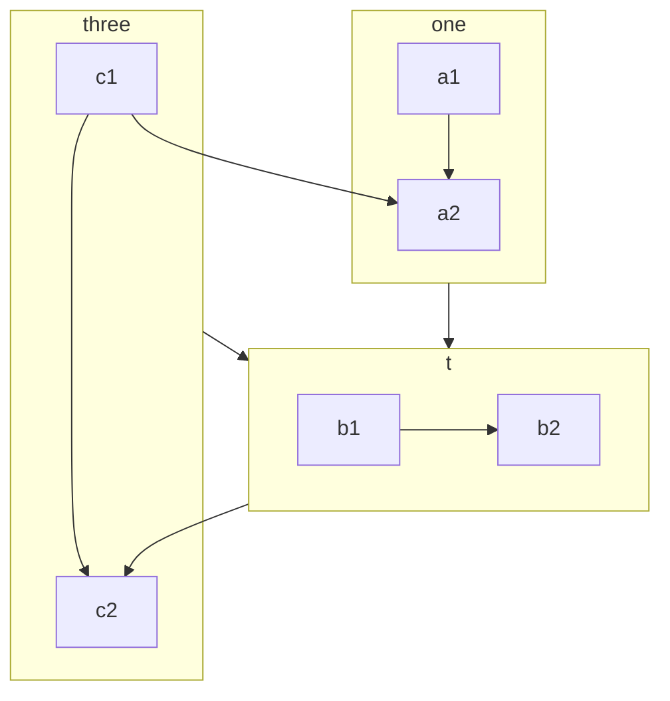

<!-- # 2021年1月8日 星期五 22点17分  -->
* 快速进行代码区块编辑
  * fenced codeblock 

* 关于粘贴图片
  {
    "pasteImage.path": "${projectRoot}/picture/img/${currentFileNameWithoutExt}",
    "pasteImage.basePath": "${currentFileDir}",
    "pasteImage.forceUnixStyleSeparator": true,
    "pasteImage.prefix": ""
  }
  插件paste image mushan

  {
      // "pasteImage.path": "${projectRoot}/picture/img/pic_${currentFileNameWithoutExt}",
      // "pasteImage.path": "${currentFileDir}/pic_${currentFileNameWithoutExt}",
      // "pasteImage.basePath": "${currentFileDir}",
      // "pasteImage.forceUnixStyleSeparator": true,
      // "pasteImage.prefix": "",
  }

## 关于用Markdown 作图
* 参考文章
  * [mermaid](https://mermaid-js.github.io/mermaid/#/sequenceDiagram?id=messages)

* Line
  
* Activations
  ```shell
  sequenceDiagram
    Alice->>John: Hello John, how are you?
    activate John
    John-->>Alice: Great!
    deactivate John
  ```
* Alt
  sequenceDiagram
    Alice->>Bob: Hello Bob, how are you?
    alt is sick
        Bob->>Alice: Not so good :(
    else is well
        Bob->>Alice: Feeling fresh like a daisy
    end
    opt Extra response
        Bob->>Alice: Thanks for asking
    end
* background
  rect rgb(0, 255, 0)
  ... content ...
  end
  rect rgba(0, 0, 255, .1)
  ... content ...
  end

* 时序图


------



----

如何画各种各样不同的图
如何在图里添加数学公式等。

$\approx$
$\overset{a}{b}$
$\exist$
$\oplus$
$\neg$
$\ne$
$\in$
$\notin$
$\subseteq$
$\cup$
$\cap$
$\Delta$
$\Sigma$
$\Pi$
$\Phi$
$\leftarrow$
$\Leftarrow$

[流程图](https://mermaid-js.github.io/mermaid/#/flowchart)
[流程图符号说明](https://www.sohu.com/a/236178167_505826)




__test__

__test__



为什么这里的subgraph two会出现横向的箭头
是否只想子图内元素的原因

## 如何将图片剧中
```html
<div align=center>

</div>
```

## 实现快速折叠区块
<details>
<summary>sdfdsf</summary>

__fdsfdsf__
</details>


## 数学公式
$Cur(a)=History(a)\times\Phi(t) + Entiro(R(a), P(a))\times \rho(t)$

$\Phi(t) + \rho(t) = 1$

## 表格

|  表头   | 表头  |
|  ----  | ----  |
| 单元格  | 单元格 |
| 单元格  | 单元格 |

## 参考资料
[Markdown 教程](https://www.runoob.com/markdown/md-tutorial.html)
