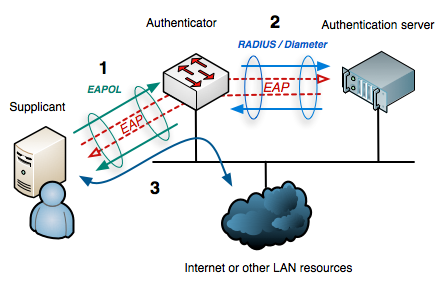

# freeradius


## 无线局域网简介

### 协议
802.3是有线局域网，802.11是无线局域网，802.1x是802.1协议族的一员(wikipedia)。

#### 802.11
    IEEE 802.3 is otherwise known as the Ethernet standard and defines the physical layer and the media access control (MAC) of the __data link layer__ for wired Ethernet networks, generally as a local area network (LAN) technology.
    802协议族工作于数据链路层。
    |Generation|protocol|Linkrate(Mbit/s)|Radio Frequency(GHz)|Adopted|
    |--|--|--|--|--|
    |WiFi 0|802.11|1-2|2.4|1997|
    |WiFi 1|802.11a|1-11|5|1999|
    |WiFi 2|802.11b||6-54|2.4|1999|
    |WiFi 3|802.11g||6-54|2.4|2003|
    |WiFi 4|802.11n||72-600|2.4/5|2008|
    |WiFi 5|802.11ac||433-6933|5|2014|
    |WiFi 6E|802.11ax||600-9608|2.4/5/6|2020|
    * WiFi Hollow

#### 802.11i
    > IEEE 802.11i-2004, or 802.11i for short, is an amendment to the original IEEE 802.11, implemented as Wi-Fi Protected Access II (WPA2). The draft standard was ratified on 24 June 2004.

    是对802.11的修订，WPA2是其实现。
    Wired Equivalent Privacy (WEP)被爆出漏洞，厂商针对802.11i草案实现了WPA以应对漏洞。
    正式协议的实现，被称为WPA2。
* WEP协议流程，弱点，怎么破解。
* WPA协议流程。
* WPA2协议流程。

#### 802.1x
    
    有三个角色，`supplicant`(请求者), `authenticator`(认证者), `authentication server`(认证服务器)
    * supplicant
        必须提供密码或证书。实现软件主要是`wpa_supplicant`。
    * 验证者
        转发凭证
    * 验证服务器
        决定是否允许接入。实现软件主要是`freeradius`。

## freeradius
FreeRADIUS is the most popular open source RADIUS server[3] and the most widely deployed RADIUS server in the world.
是最流行的和最广泛使用的`radius server`。
### 安装
`apt install freeradius`
The server daemon is called __freeradius__ instead of radiusd.
The configuration files are also located in __/etc/freeradius/__ instead of /etc/raddb/.
1. 启动
> When the server has been installed on a new machine, the first step is to start it in debugging mode, as user `root`:

在调试之前，应先保证`freeradius`处于关闭状态。
`radiusd -X`

2. 初始测试
In ubuntu, edit`/etc/freeradius/3.0/users`，注释user`bob`。
```
bob     Cleartext-Password := "hello"
        Reply-Message := "Hello, %{User-Name}"
```
执行`radtest bob hello 127.0.0.1 100 testing123`，有`Access-Accept`即为测试成功。

### 测试程序eapol_test
The default installation of wpa_supplicant does not include the eapol_test program, so it will need to be built from source. Below are instructions that describe how to build the eapol_test program.
若要测试eap，`eapol_test`更好，但`wpa_supplicant`默认安装不包含`eapol_test`，因此需自己下载源码编译。
1. To use wget to build eapol_test, enter the following:
    `wget http://hostap.epitest.fi/releases/wpa_supplicant-0.7.3.tar.gz`
2. Extract the archive, and set up the build configuration file
    ```
    tar -zxf wpa_supplicant-0.7.3.tar.gz
    cd wpa_supplicant-0.7.3
    cp defconfig .config
    vi .config
    ```
3. To enable eapol_test, find the line containing:
    #CONFIG_EAPOL_TEST=y
    Change it to:
    CONFIG_EAPOL_TEST=y
    Save the file.    
4. Type the following at the shell prompt:
    make eapol_test
5. Copy the file to a directory in your PATH
6. EAP-MD5
    1. Save the following file as eap-md5.conf:
        ```shell
        network={
        key_mgmt=NONE
        eap=MD5
        identity="bob"
        password="hello"
        }
        ```
    2. Perform an EAP-MD5 test by running the following command:
        `eapol_test -c eap-md5.conf -s testing123 -n` 
7. EAP-MSCHAPv2
    ```shell
    network={
        key_mgmt=WPA-EAP
        eap=MSCHAPV2
        identity="bob"
        password="hello"
    }
    ```
    2. To run the test, enter the following in the command line:
        `eapol_test -c eap-mschapv2.conf -s testing123`
8. 可以不在本机，在其它机器上测试.
    `eapol_test -a 192.168.122.196  -c eap-ttls-pap.conf -s testing123 -n`
### sql
[guide/SQL HOWTO for freeradius 3.x on Debian Ubuntu](https://wiki.freeradius.org/guide/SQL-HOWTO-for-freeradius-3.x-on-Debian-Ubuntu)
[Method 2— The Hard Way](https://draculaservers.com/tutorials/freeradius-ubuntu-18-04-mysql/)

1. Example setup of MySQL database
* Create SQL schema
        `mysql -uroot -p radius < mods-config/sql/main/mysql/schema.sql`
    * Create MySQL User and grant permissions
        mysql -uroot -p radius < `mods-config/sql/main/mysql/setup.sql`
2. Set FreeRADIUS to use SQL
    安装必要组件
    `apt-get install freeradius freeradius-mysql freeradius-utils -y`
    1. 配置sql组件
        `FreeRADIUS`默认使用`file`
        ```shell
        cd /etc/freeradius/3.0/mods-enabled
        ln -s ../mods-available/sql sql
        ```
        配置sql, 如果不需要与mysql 建立tls 连接，注释sql 中的tls设置。
        vim /etc/freeradius/3.0/mods-enabled/sql
        ```shell
        driver = "rlm_sql_mysql"
        dialect = "mysql"
        server = "localhost"
        port = 3306
        login = "radius"
        password = "radpass"
        radius_db = "radius"
        read_clients = yes
        ```

    2. 启用sql组件
    打开`default`配置文件
        ```shell
        cd /etc/freeradius/3.0/sites-available/
        vim default
        ```
        For all categories, remove the “file” directive and add the “sql” one. This will instruct FreeRADIUS to relly on the database for user management.
        在所有的策略中，将`file`删除，添加`sql`, 这会使`FreeRADIUS`依赖数据库查询用户数据。
            ```shell
            authorize {
            .....
            sql
            ....
            }
            accounting {
            ......
            sql
            ....
            }
            ```
    3. 将users文件中的用户信息注释
3. 填充 SQL 数据库
    ```
    >  use radius;
    >  insert into radcheck (username,attribute,op,value) values("bob", "Cleartext-Password", ":=", "hello");
    ```
4. 测试
    `radtest bob hello 127.0.0.1 100 testing123`

### eap-ttls
    [FreeRADIUS resources](https://networkradius.com/technology/freeradius/)
    [EAP Testing](http://deployingradius.com/scripts/eapol_test/)
* 生成生成证书
    为了使用 `TLS`为基础的 `EAP`方法，必须在服务器上创建证书。
    ```shell
    $ cd raddb/certs
    $ ./bootstrap
    ```
    如果没有输出，说明之前已经被创建过，否则应该显示很多输出。
* 测试
    按照Chapter 6 - EAP Authentication(该文档在networkradius网站)中的操作即可
    ```
    network={
        key_mgmt=WPA-EAP
        eap=TTLS
        identity="bob"
        anonymous_identity="bob"
        password="hello"
        phase2="auth=PAP"
    }
    ```
    `eapol_test -c eap-ttls-pap.conf -s testing123`
    `eapol_test -c peap-mschapv2.conf -s testing123`
* 实际运用时的证书
    更改`.conf`文件中的密码即可。

### 获取用户的ip
