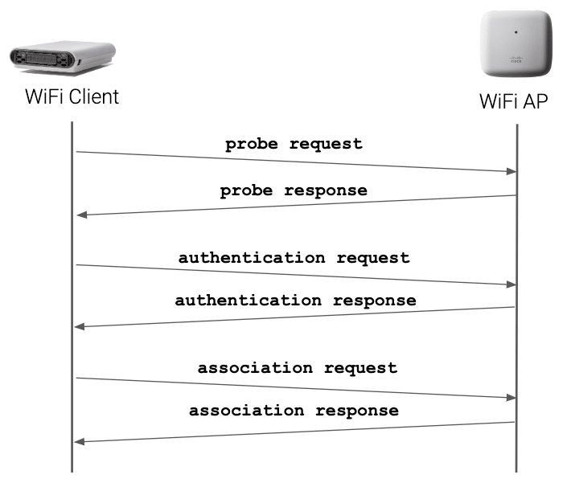
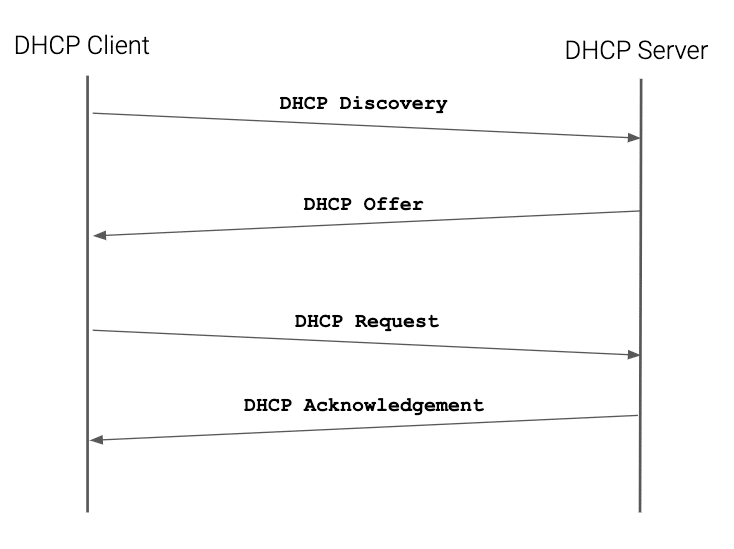

# WiFi连接是如何工作的
本文大部分参考[How WiFi Connection Works](https://netbeez.net/blog/how-wifi-connection-works/)

## WiFi 连接
主要有两个过程。第一个过程是WPA(WiFi Protected Access)_supplicant负责，第二个过程是由DHCP client负责。

## 参考文献
[How WiFi Connection Works](https://netbeez.net/blog/how-wifi-connection-works/)
[Station Authentication and Association](https://netbeez.net/blog/station-authentication-association/)
[Securing Your Network with the 4-Way Handshake](https://netbeez.net/blog/secure-network-4-way-handshake/)

[WiFi认证—分析从连接WiFi到上网的全过程(一)](https://www.modb.pro/db/146335)
[IP地址的获取—分析从连接WiFi到上网的全过程(二)](https://www.modb.pro/db/146336)
[WiFi连接过程简要分析](https://wenku.baidu.com/view/91397ef3350cba1aa8114431b90d6c85ec3a883f.html?_wkts_=1668828633834&bdQuery=wifi%E8%BF%9E%E6%8E%A5%E5%8C%85%E5%88%86%E6%9E%90)

