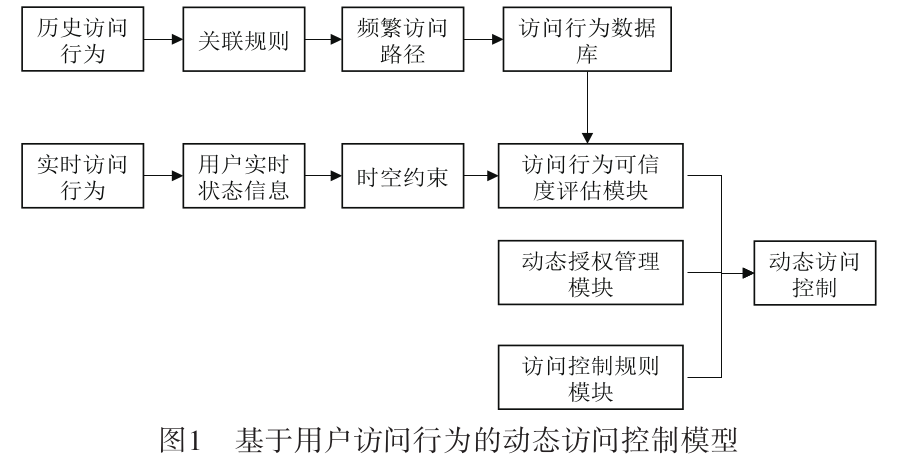

# 文献阅读
似乎有好多关于区块链的访问控制
## 中文
### 云计算环境下基于用户访问行为的动态访问控制模型的研究
  首先，采用关联规则的方法对用户历史访问行为进行分析，提取用户频繁访问路径并创建访问行为数
  据库；
  然后，基于实时访问行为获取用户实时状态信息，利用“时空切片”的方式构建具有时空敏感性的可信度
  评估模块；
  
  

### 基于信任度的物联网访问控制模型研究
    在基于角色的访问控制模型中引入用户信任度分析,建立用户属性集,
    通过用户信任度值变化动态调整用户的访问权限

* 模型根据资源的信任度计算机制计算用户的信任值,得到用户的总体信任值
  * 直接信任
    将行为分解成特征，计算简单加权和
  * 间接信任
    * 历史信任
    * 推荐信任

### 基于零信任的动态访问控制模型的研究
通过信任度量体系持续性的对信任主体进行度量评估。

基于身份的信任评估

## 英文
### A Survey on Zero Trust Architecture: Challenges and Future Trends
零信任架构，身份认证，访问控制，信任评估

由于是基于身份的访问控制，因此身份认证极为重要。

设备到设备的身份认证：可用于身份认证的功能相对较少。
1. 电池容量作为动态特征进行身份认证。
2. 利用电磁辐射进行设备间的认证。
3. 基于区块链和信任评估的身份认证
4. 基于证书的身份认证。

2021 年，da Silva 等人。[ 39 ]提出了具有上下文感知和基于行为的智能家居连续认证的零信任访问控制。
提出了一种零感知智能家居系统，使用零信任连续身份认证为智能家居系统提供访问控制。
以持续验证用户的真实性，由边缘计算提供支持，以消除不可靠的服务提供商和任何方式的访问。

RBAC ABAC

* 信任评估

* 文章来源
  https://www.hindawi.com/journals/wcmc/2022/6476274/

### Zero Trust Access Control with Context-Aware and Behavior-Based Continuous Authentication for Smart Homes
#### 相关文献
  阻止, 检测, 缓解
  * [Kuyucu et al. 2019]
    提出了保护因此的最好策略(state of the art)
  * holistic approach
    为设备安全提出了一个整体性的策略, 使用了多种信息源
  * [Ashibani and Mahmoud 2019]
    提出了一种以行为为基础的CA模型
    通过用户对app的使用来认证用户
  * [Amraoui et al. 2020] 
    行为为基础的模型
    在没有用户交互的情况下，进行潜在的再认证。
    依赖于大量的数据来保证合理的准确度。且依赖于云计算。

  * In [Ghosh et al. 2019]
    上下文感知的行为为基础的模型
    其中的一个贡献就是，根据过去的请求，及请求的上下文，对请求建模
    通过为执行请求，设立一个信任门限值，来阻止内部攻击。
    就像其它异常检测领域的工作一样,

  * [Bakar et al. 2016]  
    如果依赖于 历史数据，正如其它异常检测的研究，会有冷启动的问题，系统在正式运转之前，
    必须经过训练。

  * [Sikder et al. 2019]
    提出了上下文感知的 intrusion detection system, 这依赖于大量的数据提供给异常检测模块来训练。
  * [Dimitrakos et al. 2020]
    使用UCON+，通过信任评估进行持续授权
    虽然 UCON+ 高度可定制化，但其不适合没有经验的用户
  * [Scott W. Rose, Oliver Borchert, Stuart Mitchell 2020].
    不管用户过去是否通过认证，是否可靠，都有可能变为恶意用户

  * 总结
    过去要么依赖于大数据，要么依赖于云计算
应当将 异常检测和误用检测 两者相结合
* 应当把文献阅读了，了解

#### 介绍ZASH
这项工作的目的是为了阻止并缓解伪装攻击。

假冒攻击(impersonation) 首先就是窃取用户凭证，然后提权

ZASH flow: 用户指令到达 设备后，会先转发到 本地服务器，再根据交互，决定是否授权。

-> ontology manager -> content manager -> Activaty Manager

先比较策略，再比较上下文，再比较行为(markov chain)前后状态差值不能超过一定限度
第一步 验证身份
第二步 判断是否有授权
第三步 判断行为是否异常

这里似乎没有持续评估 (持续评估似乎可以由入侵检测系统完成)

* ontology manager
  判断该用户水平是否有权限操作该水平设备
  不同的用户水平在不同级别的设备上有不同的操作能力
  UL DC A

* context manager
  不同的用户水平和设备水平有不同的安全等级s
  __或许可以作为持续验证的方法__
  __根据account返回的数据__
  __因素大概有：时间 流量__
 
  发来的请求中有不同的因素
  各种因素，有其s，判断和是否大于需要的s
  若大于, 则同意，否则拒绝
  且发起验证(人脸识别或指纹识别)

* Activity Manager
  由成功的用户请求组成
  每一个UL都有自己的马尔科夫链，每一种UL有自己的pattern
  请求来了该模块才被激活
  冷启动问题由其它模块进行缓解
  * 信息来源
    * 有n个设备，每个设备只有两种状态。
    * Ay 就是 某一时刻下 设备的 状态 的 集合。
    * m 是 Ay 的个数, $m=2^n$
  如果从一个状态转换成另一个状态的概率过小，且二次验证未通过，则拒绝访问。
  Data provider 保存所有设备的状态，并提供给 activity manager
  行为为基础的，并不一定要用马尔科夫链，还是应结合自己可获得的数据。

### 物联网设备的行为相对简单
* 恶意行为:
  1. 访问未授权应用
  2. 异常时间
  3. 异常流量总量

## LSTM
3.6.12
安装 虚拟环境
安装 库
运行

## 数据集
[新一代物联网和 IIoT 应用程序的综合现实网络安全数据集](https://www.bilibili.com/read/mobile?id=17063219)

[TON_IoT datasets](https://research.unsw.edu.au/projects/toniot-datasets)
或许可以取里面的网络数据
